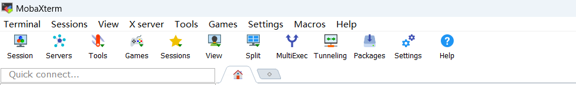
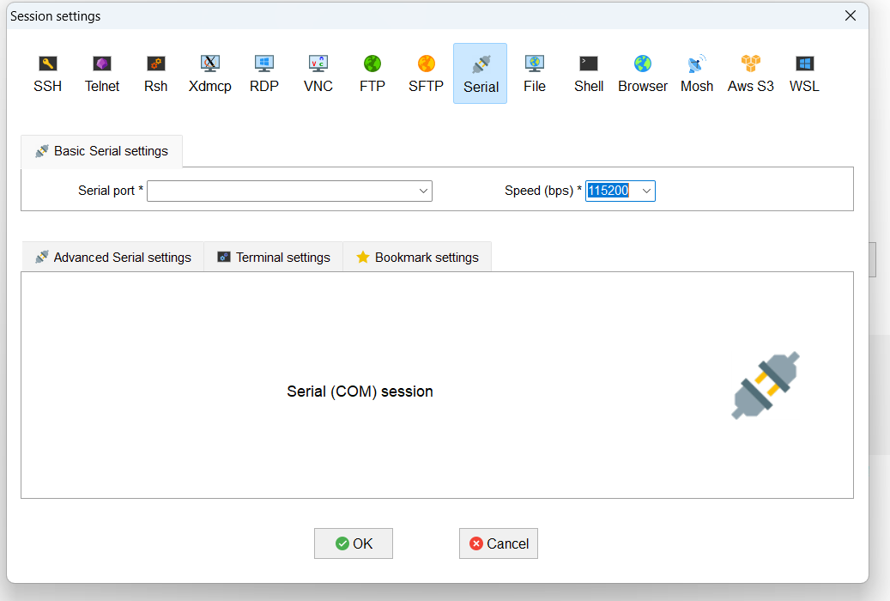

# UESTC 2024英才实验学院工程实践创新项目II——OrangePi AIpro(20T)开发板配置过程参考

## 1.介绍
确认好自己板子的型号再开始下载对应的软件与版本，本指南只适用于英才学院2024工创II 课程中所使用的昇腾OrangePi AIpro(20T)开发板，
本指南旨在提供配置过程的建议和**避免踩坑**，请配合官方用户手册使用 https://pan.baidu.com/share/init?surl=i5ZvFBPvBKr8FsazhtR9Ww&pwd=nkhh
若错误下载昇腾OrangePi AIpro(8T)版本的镜像和驱动在本开发板上是不能够正确使用的，本人亲自踩得坑。如果进入Ubuntu后没有网络链接或尝试安装驱动失败就有可能是系统镜像版本不对造成的。
另外这个开发板使用的是ARM处理器，在配置板子驱动和环境的时候注意选择正确的版本。

## 2.硬件准备
### 2.1 硬件列表
在本课程中，我们需要至少准备以下硬件：
- 1 x 昇腾OrangePi AIpro(20T)开发板
- 所有开发板自带的配件
- 1 x TF卡（MicroSD卡）（推荐致钛白片64G以上）或 1 x 2280规格NVME/SATA M.2 PCIe 3.0*4 规格及以上固态硬盘
- 1 x 电源适配器（支持PD65W 20V/3A） 电脑自带的usb供电带不动，此时板子只会空转不能正常运行，一定确保使用的电源适配器符合PD65W协议
- 1 x USB-C to USB-A数据线（用来链接UART串口调试）
- 1 x USB-C PD线（用来给板子供电，大多数支持的PD60W适配器的原装线即可，例如部分C to C的大功率手机充电器、笔记本氮化镓适配器、小米120W A to C充电器也可以）
- 1 x HDMI线（视频输出HDMI 1.4以上即可）
- 1 x 键盘（调试）
- 1 x 鼠标（调试）
- 1 x 显示器（调试）
- 1 x TF卡读卡器（镜像烧写 ，如果使用M.2硬盘的同学可以不用准备这一条，更换为固态硬盘拓展坞即可）

### 2.2 硬件说明
如果不满足硬件列表中的基础硬件要求一定要及时更换，排故时从小的配件开始依次排查，严格按照本指南和用户手册中的步骤操作。固态硬盘选择2280规格及以下的都可以支持，非2280的短盘不是很好固定，比2280还长的企业级规格就不建议选择了。
选择TF卡的可以选择致钛白片这种质量比较好的片，不至于由于此导致配置失败，工创结束后也可以继续用这张卡。某些私有协议的充电器和适配器可能不支持PD65W协议，实测Mac 原装适配器和小米120W A to C充电器都可以正确工作。
板子虽然功耗不高但是整板峰值功率可能接近35W，散热器达到70度是很正常的，实际跑的时候不要放在盒子里容易过热。本板子给的外部接口有三个USB-A，调试用的键盘鼠标尽量使用USB-A的有线键鼠。
## 3.镜像准备
本部分参考官网 https://www.mindspore.cn/docs/zh-CN/master/orange_pi/index.html 的环境搭建指南部分，结合自己的理解进行了精简。
### 3.1 镜像下载
在OrangePi官网 http://www.orangepi.cn/html/hardWare/computerAndMicrocontrollers/service-and-support/Orange-Pi-AIpro.html 下载对应板子OrangePi AIpro(20T)版本对应的Ubuntu镜像文件，不用再单独下载驱动包，镜像已经灌装好了驱动。<br>
**这里一定要谨记！！不要点那个如果百度网盘下载过慢，可以使用本链接直接下载那项，极有可能造成版本不对的后果。本人栽在了这里几个小时...**
### 3.2 镜像烧写
使用**rufus**软件烧写镜像到TF卡，然后将读卡器插入开发板的TF卡槽。
实际上，使用SSD的同理，速度比TF卡快很多。
镜像烧写完成安装好TF卡或SSD后，记得把拨码开关调到对应设备正确的位置以建立正确引导。
## 4.链接开发板
### 4.1 首次启动串口链接
首先需要将TypeC的数据线连接到UART0，注意一定要那种能传输数据的，插到电脑上就能响的那种。然后将板子的电源适配器连接到电源接口，记得不要把两个接口搞混了，板子链接电源后会自动启动，等待到风扇转速稳定声音变小稳定后，实际上就相当于操作系统开机成功了。<br>
使用MobaXterm工具进行调试，这里找到左上角的Session并点击。
<br>
然后找到Serial并点击左边的port选择对应的口，右面的波特率调整为115200. 
<br>
这时登录root或HwHiAiUser的账户，密码为Mind@123。现在，实际上你已经通过usb线成功登陆了开发板。
但是，我们需要的是使用SSH连接开发板。
### 4.2 调整网络来连接开发板
将网线连接到开发板上，另一头连接到电脑的网口段，灯光亮起来表示连接稳定了。
#### 4.2.1 修改yaml文件以配置静态IP（最简单的方法）
在linux系统中，通过以下命令进入yaml文件所在位置：
```
cd etc/netplan
```
然后，将文件文件配置修改为以下文件，本部分感谢课程助教许哥提供。
```
network:
  version: 2
  renderer: networkd
  ethernets:
    eth0:
      dhcp4: no
      addresses: [192.168.137.37/24] #注意，这里可以不用修改，这个可以直接作为静态IP
      routes:
        - to: 0.0.0.0/0
          via: 192.168.137.1  #这里的IP修改请继续阅读下文
      nameservers:
        addresses: [8.8.8.8, 8.8.4.4]

```
via后面的IP实际上是windows的网络连接部分来查询的。快捷键：windows+R，弹出后在里面输入ncpa.cpl，会自动弹出。
找到外界网口的选项，TODO!!!这里还没写完 <br>
最后成功通过SSH连接上了开发板，你会发现
这时MobaxTerm的左边就有了可以之间看到的内部文件了，这样就方便很多了。<br>
当然还有个简单的联网方式，如果你的板子可以连接wifi，可以直接通过以下命令：
```
nmcli dev wifi
```
wifi将自己弹出，找到对应的wifi进行以下命令连接：
```
sudo nmcli dev wifi connect <wifi_name> password <wifi_password>
```
这样直接就能联网啦！
### 4.3 环境配置
这里我们高度概括，需要做两件事情：对CANN进行升级（分为Toolkit和Kernels），下载mindspore。<br>
#### 4.3.1 配置toolkit文件
首先，一定要确保你是在root的账户下操作的！<br>
开始进行第一步关键的操作，这个命令将取决于你后续在官网下载Toolkit和Kernel的版本。
```
uname -a
```
记下来之后，开始对Toolkit进行操作。首先删除镜像自带的版本，必须做这一步删除操作，因为这样你才可以有足够的空间装下你后来升级后的CANN。默认的地点是在/usr/local/Ascend/ascend-toolkit这里，直接cd这里进去：
```
cd /usr/local/Ascend/ascend-toolkit
```
然后进行删除操作（不要怕这个rm）：
```
rm -rf *
```
这时候就有地方了，现在去官网下载Toolkit包，一定是要.run为后缀的。下载地址是这个：https://www.hiascend.com/developer/download/community/result?module=cann
看这里，一般以aarch64居多，那么你可以选择这个第一个下载：

给一个小建议，进都进来了，直接顺手把Kernels下载了就得了。因为我的板子是310b的，那么我就下载对应版本的Kernels对应的.run文件就好了，就这两个，这个网站就可以不进了。

我们进行Toolkit的安装：<br>
比如我把Toolkit这个文件放在了一个地方，那么我去找到它，那这里就是cd那个地方。<br>
如果是在ubuntu上直接下载是最方便的，如果是在windows上下完了然后再用U盘导入的话，还需要学习一下挂载，最后的目的就是找到这两个下好的.run文件。
对toolkit的这个.run文件进行授权:
```
chmod +x ./Ascend-cann-toolkit_8.0.RC2.alpha003_linux-aarch64.run
```
紧跟着直接安装：
```
./Ascend-cann-toolkit_8.0.RC2.alpha003_linux-aarch64.run --install
```
**这时我们等着就好了，不用管蹦出来的Warning。这个安装时间长一点。**
<br>
#### 4.3.2 Kernels的下载
还是先授权：
```
chmod +x ./Ascend-cann-kernels-310b_8.0.RC2.alpha003_linux.run
```
然后进行安装：
```
./Ascend-cann-kernels-310b_8.0.RC2.alpha003_linux.run --install
```
直到这些都success了，就算成功了。
#### 4.3.3 安装Mindspore
还是比较喜欢直接安装本地的whl文件，这样比较舒服。

安装好whl，直接在本地安装就好了。
```
pip install mindspore-2.4.0-cp39-cp39-linux_aarch64.whl
```
下载成功之后，我们就完成了配置环境的全流程了！
然后就是我们后面的流程，你可以尝试一下华为官网给出的案例：https://github.com/mindspore-courses/orange-pi-mindspore ，或者直接git下来：
```
git clone https://github.com/mindspore-courses/orange-pi-mindspore.git
```
和windows系统不一样，我们的推理执行要先运行一下sh文件：
```
cd /home/HwHiAiUser/samples/notebooks/  
./start_notebook.sh
```
然后就是和jupyter notebook一样的用法了，读者们可以自行摸索学习了！谢谢你能耐心看到这里，祝你工程顺利！<br>
**致谢：**<br>
**感谢工创实践创新项目II课程指导老师郝家胜老师对本次项目的大力支持以及对本次课程的巨大贡献，每次课老师都对我们给予很大的帮助，感谢郝家胜老师对我们的鼓励，在这次课程上我们的收获颇多，都基于郝家胜老师对我们的谆谆教诲。并且感谢助教许昊旻学长对本次香橙派配置方面问题答疑的巨大帮助！**
